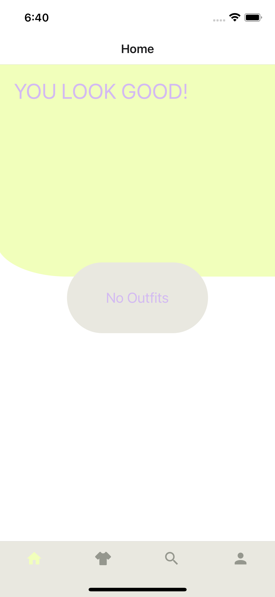
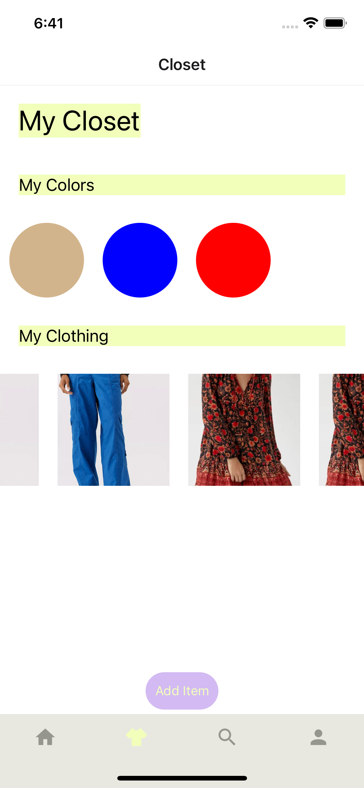
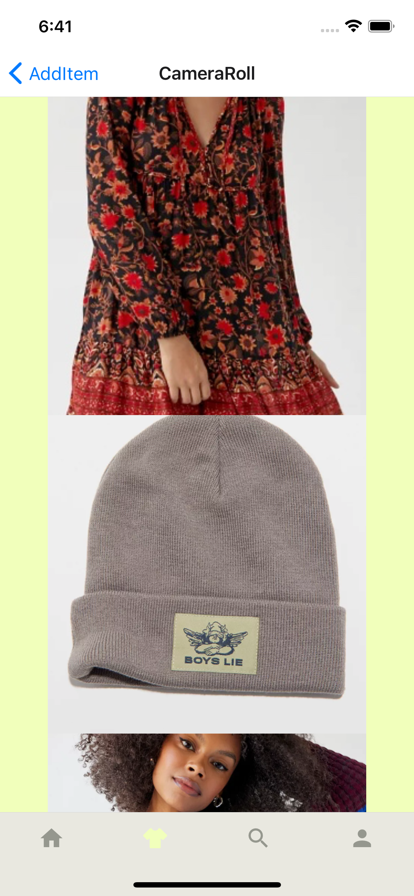
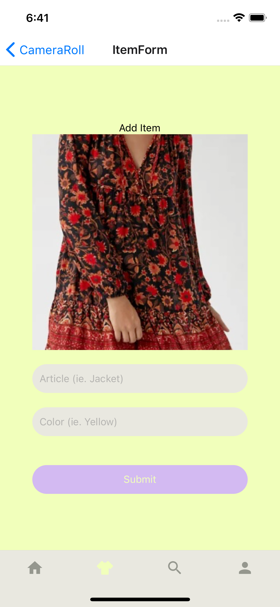

  <h1 align="center">YellowJacket</h1>
  <h2 align="center">A wardrobe management app.</h2>
  <h3>🚧 Currently in development 🚧</h3>

 

  
  
  

 

## Features

&emsp;👋 Create a profile
&emsp;📷 Upload or take pictures of clothing items
&emsp;👒 Categorize items by type and color
&emsp;🎨 Create collections of items as outfits

## Gallery

### Home Screen

### Closet Tab

### Add Item

### Select Photo

### Add Metadata

