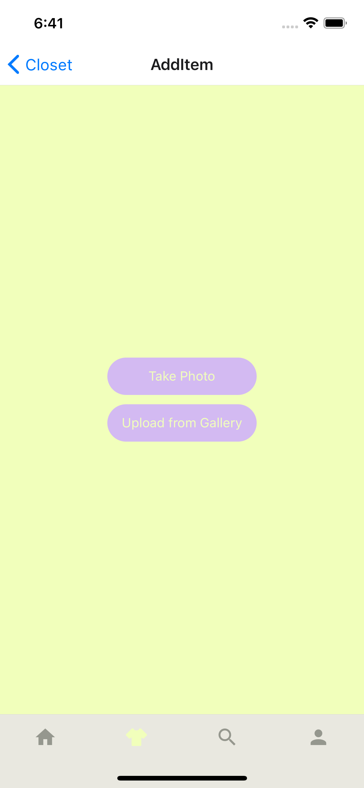

  <h1 align="center">YellowJacket</h1>
  <h2 align="center">A wardrobe management app.</h2>
  <h3>🚧 Currently in development 🚧</h3>

 

  

## Features

- 👋 Create a profile
- 📷 Upload or take pictures of clothing items
- 👒 Categorize items by type and color
- 🎨 Create collections of items as outfits

## Gallery

    
